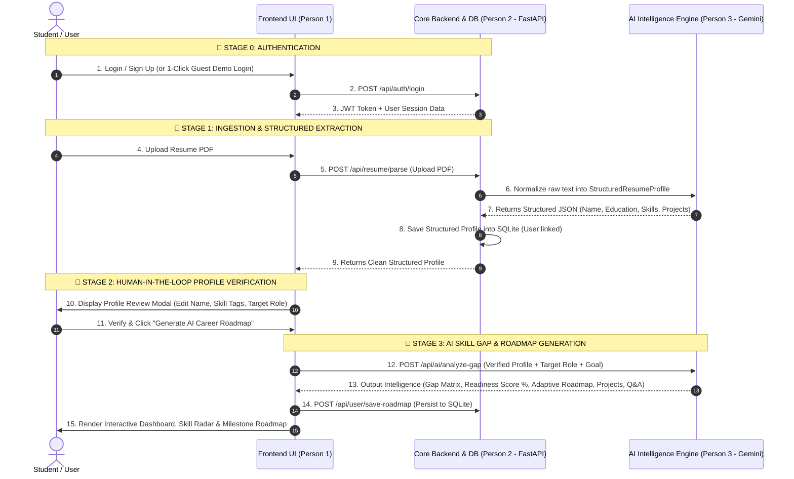
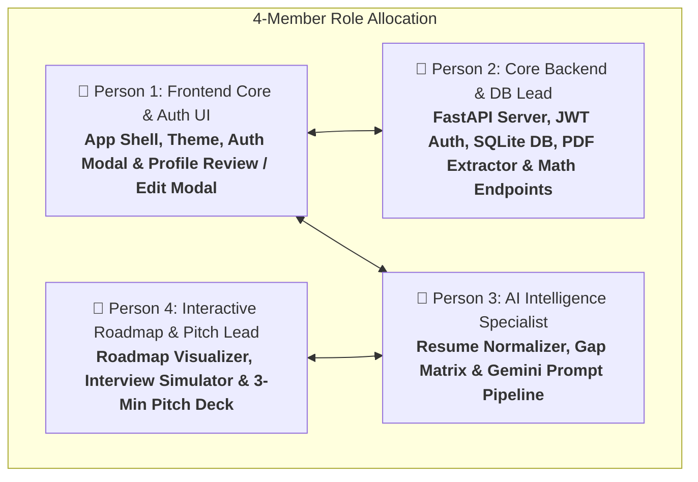

# SkillForge AI: Personalized Learning & Career Mentor — Implementation Plan & Flow

SkillForge AI is an intelligent career acceleration platform designed to bridge the gap between student competencies and industry expectations. It analyzes student resumes, project portfolios, and target roles to identify skill deficiencies, generate adaptive milestone-based learning roadmaps, curate portfolio projects/certifications, and provide AI-driven interview readiness assessments.

---

## 🛠️ The Definitive Hackathon Tech Stack

Carefully curated for **lightning-fast setup, zero demo latency, deterministic AI outputs, and clean 4-person parallel development**:

```
┌────────────────────────────────────────────────────────────────────────────────────────┐
│                               FRONTEND CLIENT (Vite + React)                           │
│  • Framework: React 18 / 19 with Vite (Instant HMR & lightning-fast builds)             │
│  • Styling: Tailwind CSS (Modern dark mode, glowing borders & glassmorphism)           │
│  • Component Icons: Lucide React (Clean, consistent developer icon suite)               │
│  • Charts & Data Viz: Recharts (Skill Radar Charts, Placement Readiness radial donuts) │
│  • Micro-Animations: Framer Motion (Smooth roadmap node transitions & stagger effects) │
│  • State & Auth: React Context API + JWT Decode + LocalStorage (Instant demo cache)    │
└───────────────────────────────────────────┬────────────────────────────────────────────┘
                                            │ REST API (JSON + JWT Bearer Auth)
                                            ▼
┌────────────────────────────────────────────────────────────────────────────────────────┐
│                               CORE BACKEND (Python FastAPI)                            │
│  • Server Framework: FastAPI + Uvicorn (High performance, async, auto Swagger at /docs)│
│  • PDF Parsing Engine: pdfplumber / pypdf (Flawless multi-column text extraction)       │
│  • Data Validation: Pydantic v2 (Strict typing, schema enforcement & auto docs)        │
│  • Authentication: JWT (python-jose) + bcrypt password hashing (passlib)               │
│  • ORM & Database: SQLModel / SQLAlchemy with SQLite (Zero-config local file DB)       │
└───────────────────────────────────────────┬────────────────────────────────────────────┘
                                            │ Pydantic Structured JSON Prompts
                                            ▼
┌────────────────────────────────────────────────────────────────────────────────────────┐
│                               AI & LLM INTELLIGENCE LAYER                              │
│  • AI Provider: Google Gemini 1.5 Flash API (google-genai / google-generativeai)       │
│  • Mode: Structured JSON Schema Enforcement (Native response_schema via Pydantic)      │
│  • Responsibilities: Resume text normalization, Skill Gap matrix, Adaptive Roadmaps,  │
│    Project blueprints, and AI Mock Interview answer grading                            │
└────────────────────────────────────────────────────────────────────────────────────────┘
```

---

### 📦 Complete Dependency Manifest & One-Liner Install Commands

#### 1. Frontend Client Dependencies:
```bash
# In client/ directory:
npm install lucide-react recharts framer-motion clsx tailwind-merge canvas-confetti jwt-decode
npm install -D tailwindcss postcss autoprefixer
```

#### 2. Backend Server Dependencies:
```bash
# In backend/ directory:
pip install fastapi uvicorn "python-multipart" pydantic sqlmodel "passlib[bcrypt]" "python-jose[cryptography]" pdfplumber google-generativeai python-dotenv
```

---

## 🧭 System Architecture & Data Flow



---

## 📋 The Unified Data Contract (`backend/schemas.py`)

All 4 teammates develop against these shared Pydantic / JSON schemas:

```python
from pydantic import BaseModel, Field
from typing import List, Optional

class ExtractedProject(BaseModel):
    title: str
    tech_stack: List[str]
    description: str

class StructuredResumeProfile(BaseModel):
    candidate_name: str
    contact_email: Optional[str] = None
    education: str
    current_skills: List[str]
    tools_and_platforms: List[str]
    projects: List[ExtractedProject] = []
    certifications: List[str] = []

class SkillItem(BaseModel):
    skill: str
    proficiency_or_importance: str  # e.g., "85%" or "Critical"

class RoadmapMilestone(BaseModel):
    id: str
    title: str
    duration: str
    completed: bool = False
    action_items: List[str]
    curated_resources: List[str]

class ProjectBlueprint(BaseModel):
    id: str
    title: str
    difficulty: str
    skills_gained: List[str]
    architecture_overview: str
    github_starter_steps: List[str]

class MockInterviewQnA(BaseModel):
    id: str
    topic: str
    question: str
    ideal_answer_points: List[str]

class FullCareerIntelligencePackage(BaseModel):
    readiness_score: int
    summary_assessment: str
    skills_present: List[SkillItem]
    skills_missing: List[SkillItem]
    roadmap: List[RoadmapMilestone]
    recommended_projects: List[ProjectBlueprint]
    mock_interview_questions: List[MockInterviewQnA]
```

---

## 🗄️ Database Models (`backend/models.py`)

```python
from sqlmodel import SQLModel, Field, Relationship
from typing import Optional, List
from datetime import datetime

class User(SQLModel, table=True):
    id: Optional[int] = Field(default=None, primary_key=True)
    name: str
    email: str = Field(unique=True, index=True)
    hashed_password: str
    created_at: datetime = Field(default_factory=datetime.utcnow)
    
    resume_profile: Optional["SavedResume"] = Relationship(back_populates="user")
    roadmaps: List["RoadmapRecord"] = Relationship(back_populates="user")

class SavedResume(SQLModel, table=True):
    id: Optional[int] = Field(default=None, primary_key=True)
    user_id: int = Field(foreign_key="user.id", unique=True)
    raw_text: str
    structured_json: str  # Serialized StructuredResumeProfile
    updated_at: datetime = Field(default_factory=datetime.utcnow)
    
    user: Optional[User] = Relationship(back_populates="resume_profile")

class RoadmapRecord(SQLModel, table=True):
    id: Optional[int] = Field(default=None, primary_key=True)
    user_id: int = Field(foreign_key="user.id")
    target_role: str
    readiness_score: int
    data_json: str  # Full structured FullCareerIntelligencePackage
    updated_at: datetime = Field(default_factory=datetime.utcnow)
    
    user: Optional[User] = Relationship(back_populates="roadmaps")
```

---

## 👥 4-Person Team Work Distribution Matrix



| Member | Role & Tech Focus | Files Owned (Zero Merge Conflicts) | Key Deliverables |
| :--- | :--- | :--- | :--- |
| **Person 1** | **Frontend Core & Auth UI**<br/>*(React, Tailwind, Context)* | `src/App.jsx`<br/>`src/context/AuthContext.jsx`<br/>`src/context/CareerContext.jsx`<br/>`src/components/AuthModal.jsx`<br/>`src/components/Navbar.jsx`<br/>`src/components/ProfileReviewModal.jsx` | 1. App shell & dark glassmorphism theme.<br/>2. **Auth Modal** (Login, Signup & 1-Click Demo Guest Button).<br/>3. **Profile Review & Edit Modal** with interactive skill chips.<br/>4. User session state handling. |
| **Person 2** | **Core Backend, Auth & DB Lead**<br/>*(FastAPI, SQLModel, JWT, pdfplumber)* | `backend/main.py`<br/>`backend/models.py`<br/>`backend/schemas.py`<br/>`backend/routes/auth.py`<br/>`backend/routes/resume.py`<br/>`backend/routes/progress.py`<br/>`backend/data/role_benchmarks.json` | 1. JWT authentication endpoints (`/register`, `/login`, `/me`).<br/>2. SQLite database models for Users and Saved Roadmaps.<br/>3. PDF resume parsing endpoint.<br/>4. Progress recalculation math endpoint. |
| **Person 3** | **AI Intelligence Specialist**<br/>*(Gemini 1.5 Flash SDK, Pydantic schemas)* | `backend/routes/ai.py`<br/>`backend/services/gemini_service.py`<br/>`src/services/mockData.js` | 1. Step 1 Resume-to-Profile extraction prompt.<br/>2. Step 2 Gap Matrix & Adaptive Roadmap generation.<br/>3. AI Mock Interview evaluator prompt. |
| **Person 4** | **Roadmap, Interview & Pitch Lead**<br/>*(Recharts, Framer Motion, Markdown)* | `src/components/RoadmapTimeline.jsx`<br/>`src/components/MockInterviewHub.jsx`<br/>`src/components/SkillGapRadar.jsx`<br/>`src/components/ProjectRecommendations.jsx`<br/>`docs/pitch_deck.md` | 1. Animated vertical roadmap with checkboxes.<br/>2. AI Mock Interview quiz interface.<br/>3. Skill Radar Chart & 3-minute winning pitch deck. |

---

## 🧪 24-Hour Hackathon Execution Timeline

| Time Frame | Milestone Goal | Verification Gate |
| :--- | :--- | :--- |
| **Hours 0 – 2** | Setup repo, install packages, establish schemas | Frontend and FastAPI `/docs` running locally. |
| **Hours 2 – 8** | Parallel component building with mock schemas | Auth modal, PDF parser, Gemini prompts, and radar charts functional independently. |
| **Hours 8 – 14** | Full end-to-end integration | Real PDF upload ➔ Profile review ➔ AI Gap Analysis ➔ Interactive Roadmap rendering. |
| **Hours 14 – 18** | Interactive score math, checkboxes & animations | Completing roadmap milestones updates Placement Readiness Score dynamically. |
| **Hours 18 – 22** | Preloaded demo profiles & slide deck | 1-click guest login with 3 sample profiles for flawless judging. |
| **Hours 22 – 24** | Deployment (Vercel + Render) & Pitch rehearsal | Live production URL ready + 3-minute timed pitch rehearsals. |
